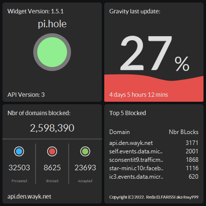
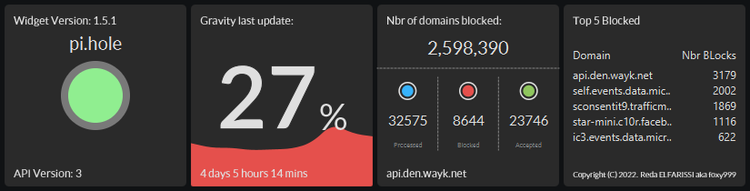
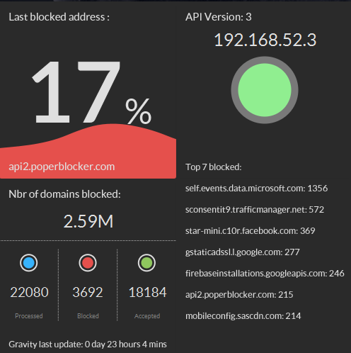
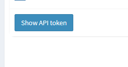

# <ins>Table of contents</ins>
- [Overview](#overview)
  * [Features](#features)
  * [Upcoming features](#upcoming-features)
- [Support ](#donation)
- [Installation](#installation)
    * [Pre-Requisites](#pre-requisites)
    * [Configuration](#configuration)
      * [Where to find the API TOKEN](#where-to-find-the-api-token)
      * [Personalize your Widget](#personalize-your-widget)
    * [Running the widget](#running-the-widget)
- [Testing ](#testing) 
- [Credits ](#credits)
- [License ](#licence)

# <ins>Overview</ins>
## Pi-Hole DNS Widget for Desktop
PiHole Widgets is a project I needed to make for my personal needs, and I decided to share it with you.

It is developed with JavaFX, and uses the framework TilesFX.

##### Screen Shots
###### <ins>Square</ins>

###### <ins>Horizontal</ins>

### <ins>Features</ins>

- Live stats from pihole servers.
- Modern widgets.
- Comes with a simple install/uninstall for Windows.
- Great summary of your pihole DNS in one place.
- Show the last blocked domain.
- Shows last time gravity was updated.
- Change visual aspects of Widget.
- Change size to your needs.
- Simple configuration.

### <ins>Upcoming features</ins>

- Support for 2 Pi-Holes.
- Beautiful Themes.
- Hide to tray option.
- Easy to install for macOS and Linux.
- Enable/Disable Pihole from widget.

# <ins>Donation</ins>
All donations are welcome and any amount of money will help me to maintain this project :)

  
  

# <ins>Installation</ins>

### Pre-Requisites

- Java 17+
- Last version of Pihole.

### Configuration
The widget automatically sets its configuration to the default pi-hole local address if that doesn't work , open the configuration interface by right clicking on the widget then click on Settings.

Then input your pihole IP Address/Port and API Token, and click Apply.

###### Where to find the API TOKEN

###### Personalize your widget

You can set your Widget size or layout by accessing the Widget configuration panel in Settings.

### Running the widget

Exe is available for **Windows**, for other OS `Gradle run` the project, or you can package it to your needs using `gradle jpackage` or whatever tool suits you.

If you want to close Widget right-click on the Widget and a contextual menu will appear giving you the option to close it or update manually.

# <ins>Testing</ins>

App is still in Beta, not tested enough, only ran on **Windows 10**, **Mint OS** and **Ubuntu**.

if you find any bugs or want to suggest new features please go to : https://github.com/foxy999/PiHoleWidgets/issues

# <ins>Credits</ins>

Shoutout to :

- <a href="https://github.com/HanSolo/tilesfx" title="hans0l0">hans0l0</a> for the project TilesFX.
 
- <a href="https://github.com/afsalashyana" title="afsalashyana">afsalashyana</a> for the helpful Covid Widget and JavaFX Tutorials.

# <ins>Licence</ins>
Copyright (C) 2022.  Reda ELFARISSI aka foxy999

This program is free software: you can redistribute it and/or modify
it under the terms of the GNU General Public License as published by
the Free Software Foundation, either version 3 of the License, or
(at your option) any later version.

This program is distributed in the hope that it will be useful,
but WITHOUT ANY WARRANTY; without even the implied warranty of
MERCHANTABILITY or FITNESS FOR A PARTICULAR PURPOSE.  See the
GNU General Public License for more details.

You should have received a copy of the GNU General Public License
along with this program.  If not, see <https://www.gnu.org/licenses/>.         

Go back to : [Table of Content](#table-of-contents)